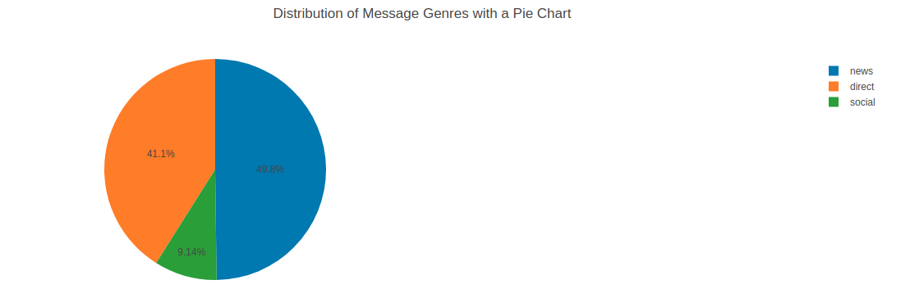

# Disaster Response Pipeline Project

### Synopsis:
This project consists of the following parts:
- **ETL Pipeline**: Here, we build load the different datasets, and write a cleaning pipeline to clean, merge and store the data in an SQLite database
- **ML Pipeline**: Here, we write a machine learning pipeline that load data from SQLite database, split the dataset into training and test sets, build a text processing and machine learning pipeline, train and tune the model using GridSearchCV, output results on the test set and export the final model as a pickle file
- **Flask Web App**: Here, we modify an already prepared web app by adding data visualizations using Plotly. Also, we modify file paths for database and model as needed.

### Files Structure:
- **data/**: This folder has the datasets, the database and the file `process_data.py`
    - **data/process_data.py**: This file contain ETL Pipeline
    - **data/DisasterResponse.db**: This file is the sqlite dataset which contain the clean dataset
    - **data/disaster_categories.csv**: This file contain the disaster categories
    - **data/disaster_messages.csv**: This file contain the disaster messages
- **models/**: This folder has the pickle database and the file `train_classifier.py`
    - **models/train_classifier.py**: This file contain the ML Pipeline
    - **models/finalized_model.pkl**: This is a pickle database containing the ML model
- **app/**: This folder has the template folder and the file `run.py`
    - **app/run.py**: This file starts the web app
    - **app/templates/**: This folder contain template files.
- **Images/**: This folder contain images
 
### Instructions:
1. Run the following commands in the project's root directory to set up your database and model.

    - To run ETL pipeline that cleans data and stores in database
        `python data/process_data.py data/disaster_messages.csv data/disaster_categories.csv data/DisasterResponse.db`
    - To run ML pipeline that trains classifier and saves
        `python models/train_classifier.py data/DisasterResponse.db models/finalized_model.pkl`

2. Run the following command in the app's directory to run your web app.
    `python run.py`

3. Go to http://0.0.0.0:3001/


### Summary:

1. ETL Pipeline

This section consisted of just cleaning and preparing the dataset for machine learning. The dataset consisted of 2 separate datasets which were cleaned, then merged into a single dataset and stored in an SQLite database.

1. ML Pipeline

Our model pipeline has the following structure:
```
    pipeline = Pipeline([
            ('vect', CountVectorizer(tokenizer=tokenize)),
            ('tfidf', TfidfTransformer()),
            ('clf', MultiOutputClassifier(estimator=RandomForestClassifier(),n_jobs=1))
        ])
```
We used the TF-IDF feature extraction technique with multi-output classification to enable multi-target classification. The model trained with **75%** accuracy.

To improve our model, we used **GridSearchCV** to find the best parameters combination for the model. However, this process took us several hours to complete

1 Data Visualization

Data visualization was added to the web app using Plotify.

1.1 Distribution of Message Genres related to natural disasters

This visualization is on message genres which are related to natural disasters like(**Weather Related, Floods, Storm, Earthquake**). The aim of this visualization was to show the distribution of these message genres.


**Figure 1**

From the graph above, we see clearly that messages related to earthquake record more counts in every genre type. Messages related to floods are almost not reported in the social genre.

1.2 Distribution of Message Genres with a Pie Chart

A similar plot formaly existed, but it was a bar chart. Here, I use a Pie chart to represent the same information.


**Figure 2**

My aim here is to represent the distribution of message genres in percentage. We can see that *News-Genre* represents the majority of the messages with **49.8%**, followed by *Direct-Genre* with **41.1%**, and lastly by *Social Genre* with **9.14%**.


### Note:
- The GridSearchCV is too expensive. For this project, it took us several hours to complete

### Links and References:
- [Multiclass and multilabel algorithms](http://scikit-learn.org/stable/modules/multiclass.html#multiclass)
- [MultiOutputClassifier](http://scikit-learn.org/stable/modules/generated/sklearn.multioutput.MultiOutputClassifier.html)
- [Hyperparameter Tuning the Random Forest in Python](https://towardsdatascience.com/hyperparameter-tuning-the-random-forest-in-python-using-scikit-learn-28d2aa77dd74)
- [GridSearchCV](http://scikit-learn.org/stable/modules/generated/sklearn.model_selection.GridSearchCV.html)
- [Pipelines With Parameter Optimization](https://chrisalbon.com/machine_learning/model_selection/pipelines_with_parameter_optimization/)